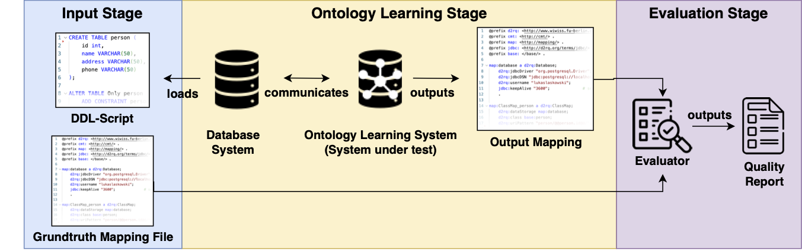

# Burr: A Benchmark for Ontology Learning from Relational Databases
Knowledge graphs and ontologies play an essential role in integrating, standardizing, and reasoning about complex data across domains. Leveraging knowledge graphs in AI use cases, instead of traditional relational databases, leads to quality improvements by up to 38 percentage points. However, learning ontologies from relational databases remains a challenging task due to the impedance mismatch between both modeling concepts. An understanding of which ontology learning system performs best, and why, is missing, as no standardized evaluation has been conducted.
We present Burr1, a benchmark for evaluating ontology learning systems from relational databases. To evaluate the ontology learning space, we introduce a novel mapping-based evaluation metric, and provide a comprehensive benchmark data collection. This collection of 46 scenarios consists of real-world database-ontology mappings, including industry data from SAP, and of a micro-benchmark evaluating the behavior of systems in encapsulated scenarios. We demonstrate the applicability of Burr by evaluating three widely used ontology learning systems using the benchmark. The results emphasize the current strengths of simple rule-based approaches compared to LLM-based systems, while also highlighting the significant research potential of LLMs in ontology learning.

# Reproducibility
To reproduce our results, please execute the command ``docker-compose up --build``. All experiments will run automatically.

# Benchmark files
This section describes the structure of the benchmark files and how to use them. The micro benchmark is split into multiple parts, each having one folder. The files can be found in folder ``train_data``. 
The real world databases and their mappings can be found in the folder ``real_world``.
Each test scenario consists of two files: 
* *SQL-File* This file includes the definition of the database and in most cases some instance data
* *Mapping file* This file represents the mapping of the database to the ontology. For better readibility, we decided to choose a ``Json`` format, which is automatically translated to ``D2RQ``. It can be easily translated to further mapping languages, such as ``R2RML``.
  

# Architecture

